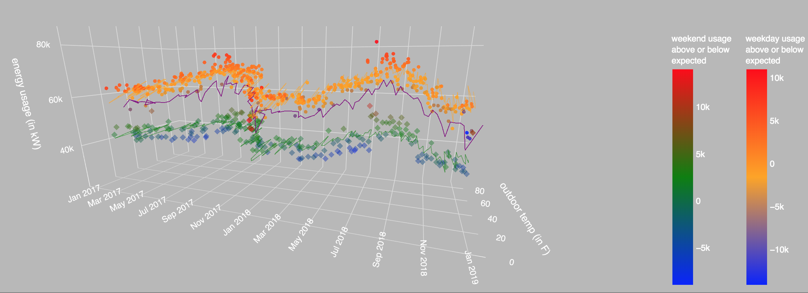
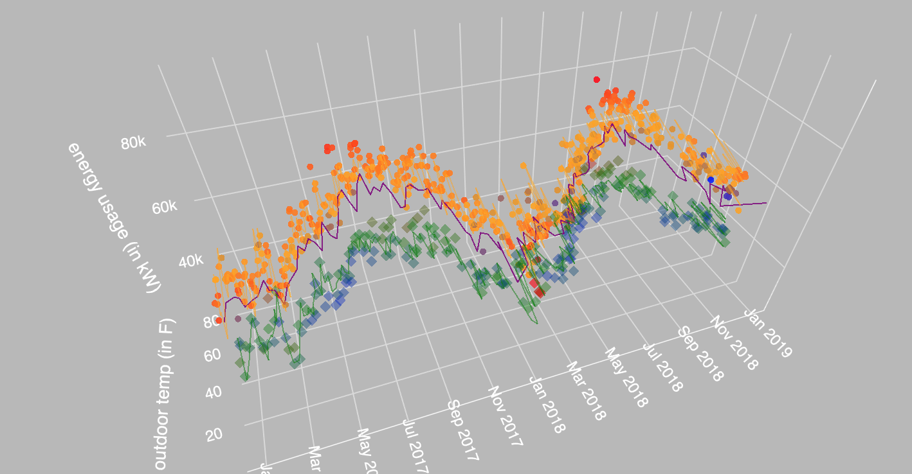
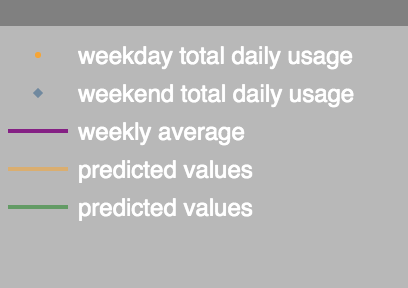
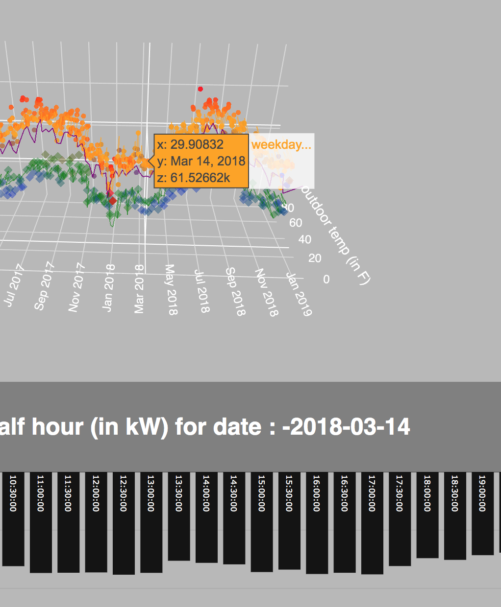

# about this app
This app shows energy usage over time for a building. 

# starting the project up 


1) start virtual environment
```bash
source venv/bin/activate
```

2) install dependencies 
```bash
 pip install -r requirements.txt
```
Make sure you are using python3. If errors are received in installing dependencies, try pip3 instead of pip.

3) start server
```bash
python app.py
```

4) navigate to browser and input the link indicated in terminal


# screenshots

### weekday and weekend data in 3d Graph
The weekday and weekend data were split on a 3d plane, with usage on the z axis and temperature on the x axis. This provided a clear sense of how the usage shifted with the seasons and weather. 

The markers were colored based on how far above or below they were from the a predictionof energy usage based on the temperature for that day. The more orange the weekday data, the closer the usage was to what was expected. For weekend data, the greenger the market, the closer to what was expected. The redder the marker, the higher usage was than expected. The bluer the marker, the lower the usage for that day was, relative to expected. 
<br>

<br>



### click to toggle data sets from legend 
To isolate data visuals, a user can toggle what is shown by clicking on the items in the legend.
<br>


### hover to see daily usage, colored by temperature
A below shart shows energy usage throughout each day the mouse is hovered over. The redder the color, the warmer the weather was for that half our interval. 
<br>


# sorting
I decided to sort the data based on objective designations rather than use a clusting model. I would assume that differences in specific sub-categories were the more important data dimension to highlight. 

The data had known obvious distinctions, most notably 'weekend' and 'weekday'. These were separated out by week number. What proved tricky was designating holidays, as they had the characteristics of weekends, but didn't always fall on a weekend. For analytical purposes were essentially the same class as a weekend. At first I thought about finding particularly low days within a given week, and designating them Holidays (beyond at least one standard deviation from the mean). This wasn't effective as there are often weeks that are on average lower because they are within the context of many holidays and cool weather. These two factors make the winter break, and Jan 1st in particular, difficult to classify. 

It seemed to make more sense because of this to compare to an absolute mean for weekend data. I chose to use the standard deviation of the given week of each specific date because if there was  high variability in that week, than it would be less likely to be classified incorrectly. This approach was effective in classifying all expected holidays. The very few days that were further classfied as holidays were subjectively acceptable as they fell well beyond the realm of normal. It seemed better to have false negatives for holidays/weekends than for week days, given that week days are clearly known, and a holiday is more subjectively identified.  

# predictions
I intended to predict energy usage and then color the markers based on if the usage was below or above the expectations based on temperature and time of day/year. 

For purposes of this model, I didn't expect high accuracy as there aren't very many dependent variables to consider. I used a basic linear regression model to come up with basic predictions.  Linear regression coefficients will be identical if you do, or don't, scale your data, because it's looking at proportional relationships between them, so the inputs weren't scaled. 

## intra-day predictions
Using time as an ordinal indicator is tricky. While the later in the day, the more likely there is higher usage, the peak usage for most days is actually midday. This makes the data more categorically relevant than ordinal, requiring transformation for it to be particularly useful. Ultimately the predictions when tested against a test case were very poor. For this reason I didn't visualize them. 

## day predictions
I ran a few models with features derived from the data, but the variables weren't uncorrelated enough for the predictions to be robust with test cases. The time of year is a proxy for weather, but as a categorical dataset it could be useful. Instead of pretending I could make a reliable modle with such limited data, it made explainig the visualization easier to predict usage based on one variable only, temperature. It was also fairly accurate, predicting 65% of the test cases accurately after training the model on a sample. 


# coding style
I aim to write descriptive code that reads as close to language as is reasonable. This results in verbose variable names, but ensures clarity. This also means that all discrete blocks of code are wrapped in functions and are often nested in layers of functionality, with meta logic pulled out at each level. This ensures legibility and decreases the need for explanatory comments. 

Per the instructions for this project, I used only Python frameworks to build out this interface. 

### jsons vs dicts  
I prefer to use json over dicts when using web structures, because that's the dominate approach, and it's better to have consistent formatting. I made an exception for layout because of how nested the variable becomes. 


# issues 

## hovering vs clicking callback 
I got cought up trying to figure out how to click and have the temperature over time, by-day, remain if clicked, despite the hover callback, but the dash functionality seems unable to manage both callbacks. No examples appeared to have solved this problem. The callback doesn't allow you to take in the output feature and all global variables are ignored under the decorator. The suggested work arounds seemed to hacky to consider. 

## note
While I appreciated how dash abstracts away much of the styling, if I were building something for a client, I would take the time to custom build my visualizations in React to ensure I have complete control over each aspect of the visualization. I found myself hunting through the documentation for specific key value pairs, and settling on whatever Dash optionality was available, rather than building everything to the design spec I had hoped for. 

### jupyter notebook
I kept my notebook in the repot for reference, but it was only used as a scratchpad. 
